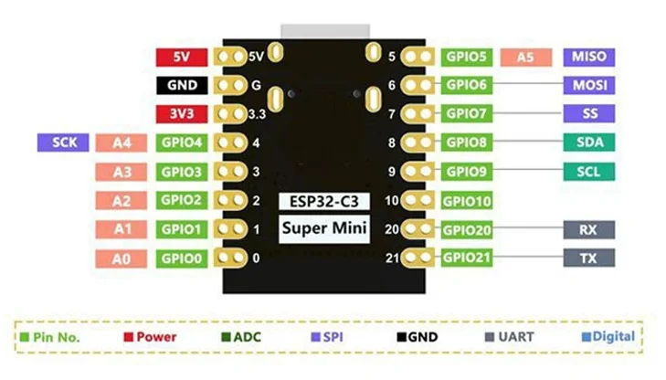
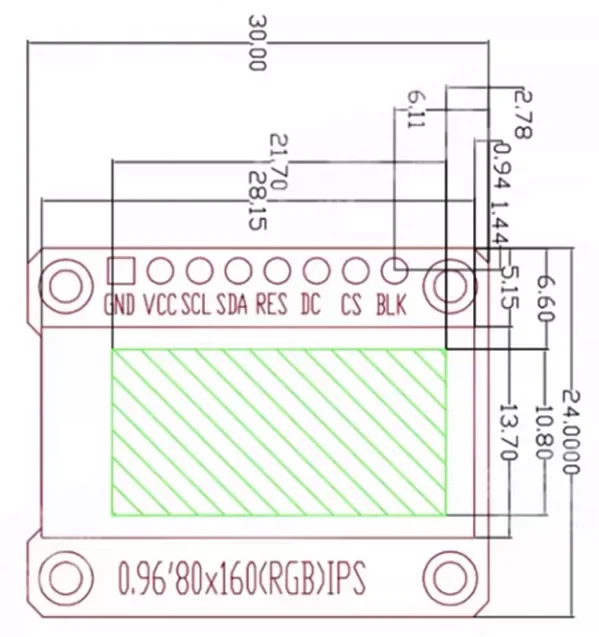

# 硬件方案

> **版本说明**：本文的选型理由、Wi-Fi 降功率、供电、USB HID 约束等内容对 v1~v4 都适用。
> 但**引脚分配、屏幕与按键接线**已在 v4 全部改变（ST7735 SPI 彩屏 + 5 独立按键
> → SSD1306 I2C OLED + 4×4 矩阵键盘）。**引脚分配以 [pinmap.md](pinmap.md) 为准**，
> 本文中标注「v1 历史」的小节仅作记录。

## 方案概述

kiboard 是一个**实体 agent 审批终端**：agent 需要确认某个操作时，设备亮灯提示、屏幕显示待批准的动作，用户按实体键决定接受 / 拒绝 / 全部接受。

### 选型：ESP32-C3 SuperMini

| 项 | 规格 |
|---|---|
| 芯片 | ESP32-C3 (QFN32, rev v0.4)，RISC-V 单核 160MHz |
| 无线 | Wi-Fi 2.4G + BLE 5 |
| Flash | 4MB 片内 (XMC) |
| USB | 原生 USB-Serial/JTAG（无需 CH340 等外置串口芯片） |
| 可用 GPIO | 13 个 |

选它的理由是**两个无线外设都在规划内**：Wi-Fi 用于设备与 hub 之间的无线通信（摆脱数据线），BLE 预留给手机配网和参数配置。若只做 USB 有线设备，用 1 元级的 CH32V003 就够，但那样这两条路都堵死了。

### 关键约束：不能做 USB HID 键盘

ESP32-C3 的原生 USB 是固定功能的 Serial/JTAG 控制器，**无法模拟 USB HID 设备**。因此 kiboard 不是"按键直接敲字符"的宏键盘，而是：

```
[按键] → 设备上报事件 → hub（主机侧服务）→ 决策/触发 agent 动作
[LED/屏幕] ← 设备执行指令 ← hub ← agent 状态
```

所有业务逻辑在 hub 侧，固件只是哑终端。好处是改玩法不用重刷固件。

### BOM

| 部件 | 数量 | 参考价 |
|---|---|---|
| ESP32-C3 SuperMini | 1 | ¥11 |
| 0.96" SSD1306 OLED + 4×4 矩阵键盘一体板（I2C 屏 + 裸矩阵键） | 1 | ¥12 |
| LED + 限流电阻 (220Ω~1kΩ) | 2~3 | 忽略 |
| 面包板 + 杜邦线 | — | 忽略 |

合计约 ¥21。原型阶段不做成本优化，用过剩的算力换开发速度。

---

## 引脚分配总表

### 板子引脚图



物理排布（USB 口朝上时）：

| 左侧（上→下） | 右侧（上→下） |
|---|---|
| 5V | GPIO5 |
| GND | GPIO6 |
| 3V3 | GPIO7 |
| GPIO4 | GPIO8 |
| GPIO3 | GPIO9 |
| GPIO2 | GPIO10 |
| GPIO1 | GPIO20 |
| GPIO0 | GPIO21 |

板子共引出 13 个 GPIO（0~10、20、21）。GPIO18/19 用于原生 USB，未引出。硬件 SPI 默认脚为
SCK=GPIO4、MOSI=GPIO6、MISO=GPIO5、SS=GPIO7，屏幕接线正是按这组默认脚走的。

### 当前占用（v4，实测通过）

13 个可用 GPIO 全部占满，且分配不是任选的——见下方「板载上拉」一节：

```
GPIO0  → 矩阵 R1              GPIO8  → LED2 板载蓝  【带板载上拉】
GPIO1  → 矩阵 R2              GPIO9  → LED0 黄      【带板载上拉】
GPIO2  → LED1 红  【带板载上拉】 GPIO10 → 矩阵 C3
GPIO3  → 矩阵 R4              GPIO18 → USB D-  【不可用】
GPIO4  → OLED SDA             GPIO19 → USB D+  【不可用】
GPIO5  → OLED SCL             GPIO20 → 矩阵 C4
GPIO6  → 矩阵 C1              GPIO21 → 矩阵 R3
GPIO7  → 矩阵 C2
```

### 板载上拉：GPIO2/8/9 只能当输出

ESP32-C3 SuperMini 在三个 strapping 脚 **GPIO2 / GPIO8 / GPIO9** 上都带板载上拉，
强度足以顶过芯片内部 45kΩ 下拉。验证方法：拔掉该脚**所有**外部接线，配置为
`INPUT_PULLDOWN` 并显式 `gpio_pullup_dis()`，依然读到 1。

实测普查（除 I2C 的 GPIO4/5 外全部设 `INPUT_PULLDOWN` + 关内部上拉）：

```
GPIO   0=0  1=0  2=1  3=0  6=0  7=0  8=1  9=1  10=0  20=0  21=0
```

所以：**三个脏引脚正好给三个 LED（输出），八个干净引脚正好给矩阵的 8 根线。**
这个分配是被硬件逼出来的，不是随手排的——把矩阵行放在 GPIO2 上会出现极难定位的
边界电压故障，详见 [pinmap.md](pinmap.md)。

---

## OLED 与矩阵键盘接线（v4，当前）

一体板拆解：左侧 OLED 走标准 I2C，右侧 4×4=16 键是**裸矩阵输出**（不带 I2C 转换芯片）。

| 一体板引脚 | 接到 | 说明 |
|---|---|---|
| OLED VCC | **3V3** | 不可接 5V |
| OLED GND | GND | |
| OLED SCL | **GPIO5** | I2C 时钟 |
| OLED SDA | **GPIO4** | I2C 数据 |
| 键盘 R1 / R2 / R3 / R4 | **GPIO0 / 1 / 21 / 3** | 行，扫描输出 |
| 键盘 C1 / C2 / C3 / C4 | **GPIO6 / 7 / 10 / 20** | 列，输入下拉 |

矩阵键盘不需要供电。OLED 实测为 **SSD1306 128×64，I2C 地址 0x3C**，
`Wire.begin(4, 5, 400000)` 工作正常，`Adafruit_SSD1306` 直接可用——
不需要 `initR` 变体、没有行列偏移、没有色序/反色陷阱，比 v1 的 ST7735 省事得多。
OLED 还能真正息屏（`SSD1306_DISPLAYOFF`），而 ST7735 的 BLK 硬接 3V3 关不掉。

### 矩阵扫描

扫描某行时：该行 `OUTPUT` 拉高，**其余三行 `INPUT_PULLDOWN`**，列脚 `INPUT_PULLDOWN`，
切换后等 50µs 再读（杜邦线寄生电容比 PCB 大）。两个都不能用的做法：

- **其余行 `OUTPUT` 拉低** —— 同列两个不同行的键同时按下会形成推挽对推挽直接短路
- **其余行纯 `INPUT`** —— 带上拉的脚会悬空成高，把高电平灌进列线造成整列误报

`INPUT_PULLDOWN` 两个要求都满足：有确定电平，且足够弱（45kΩ，约 73µA）。

### 键位映射（已实测）

`R?C?` 与物理位置一一对应，`id = (行-1)*4 + (列-1)`：

| | C1 | C2 | C3 | C4 |
|---|---|---|---|---|
| **R1** | 1 | 2 | 3 | A |
| **R2** | 4 | 5 | 6 | B |
| **R3** | 7 | 8 | 9 | C |
| **R4** | * | 0 | # | D |

---

## 显示屏接线（ST7735 0.96" SPI）— v1 历史

### 屏幕引脚图与尺寸



屏幕模块 8 针，**排针顺序（从左到右）：GND · VCC · SCL · SDA · RES · DC · CS · BLK**。

机械尺寸（后续做外壳用）：

| 项 | 尺寸 |
|---|---|
| 板子 | 30.00 × 24.00 mm |
| 显示区 | 21.70 × 13.70 mm（0.96" IPS，80×160） |
| 安装孔 | 4 个，孔径 ~2.78mm，四角分布 |
| 排针间距 | 2.54mm 标准 |

面板类型是 **IPS**（不是 TN），可视角度好，上下翻转观感差别不大。

### 接线对应

| 屏幕引脚 | 接到 | 说明 |
|---|---|---|
| GND | GND | |
| VCC | **3V3** | 不可接 5V |
| SCL / SCK / CLK | **GPIO4** | SPI 时钟（硬件 SPI 默认脚） |
| SDA / MOSI / DIN | **GPIO6** | SPI 数据（硬件 SPI 默认脚，单向，屏幕不回读） |
| RES / RST | **GPIO3** | 复位 |
| DC | **GPIO2** | 数据/命令选择 |
| CS | **GPIO7** | 片选（硬件 SPI 默认 SS） |
| BLK / BL | **3V3** | 背光常亮 |

### 为什么 BLK 直接接 3V3

背光是一组 LED，**GPIO 单脚输出电流（约 20~40mA）不足以驱动**，接 GPIO 时背光只有微弱的光。想用软件调背光需要加一个 NPN 三极管或 MOSFET，GPIO 只控制基极/栅极。当前直接接 3V3 常亮。

### 屏幕驱动参数（实测，改坏了照这个恢复）

这块屏调通花了不少时间，参数敏感：

| 项 | 值 | 说明 |
|---|---|---|
| 初始化 | `initR(INITR_MINI160x80_PLUGIN)` | 偏移 26/1。用 `MINI160x80`（24/0）边缘会有杂色条 |
| 反色 | **不要开** `invertDisplay` | 开了全局反色 |
| 色序 | 交给库自动设置 | 不要手动写 MADCTL |
| 方向 | `setRotation(3)` | 排针朝上；`1` 为朝下（180°） |
| 分辨率 | 160×80（横屏） | |
| 面板 | IPS | 可视角好，翻转方向观感差别不大 |

**排查经验**：颜色不对时先怀疑 `invertDisplay`，而不是色序。

- 红显示成青、绿显示成紫、白显示成黑 → **反色**（每个通道都取反）
- 只有红蓝互换、绿色不受影响 → **BGR 色序**问题

另有一个陷阱：`ST77XX_MADCTL_RGB` 的值是 `0x00`，拿它做位掩码是空操作；真正的色序位是 `ST7735_MADCTL_BGR = 0x08`。

### 屏幕布局（160×80）

```
┌────────────────────────────────────┐
│ kiboard *hub          -39dBm       │  y=0   顶栏：链路状态 / 信号
│                                    │
│          20:31:45                  │  y=16  时钟（大字号）
│                                    │
│       2026-07-26  Sun              │  y=48  日期 + 星期
│ hub 下发的消息区（两行，自动折行）    │  y=58  hub 消息 / 按键反馈
└────────────────────────────────────┘
```

---

## 按键接线（电子积木按键模块 ×5）— v1 历史

每个模块 3 针，**高电平输出**（按下时 OUT = VCC）：

| 模块 | GND | OUT | VCC | 计划功能 |
|---|---|---|---|---|
| 按键 0 | GND 轨 | **GPIO0** | 3V3 轨 | 接受 |
| 按键 1 | GND 轨 | **GPIO1** | 3V3 轨 | 拒绝 |
| 按键 2 | GND 轨 | **GPIO5** | 3V3 轨 | 接受所有 |
| 按键 3 | GND 轨 | **GPIO10** | 3V3 轨 | 待定 |
| 按键 4 | GND 轨 | **GPIO21** | 3V3 轨 | 待定 |

面包板上拉两条公共轨（3V3 / GND）供 5 个模块共用。注意 830 孔面包板的电源轨**中间可能断开**，跨越中缝时要用短跳线桥接——这是"接了却没电"的常见原因。

固件侧 GPIO 配置为 `INPUT_PULLDOWN`，空闲时读到低电平。

### 注意事项

**VCC 必须接 3V3。** 模块 OUT 的高电平等于 VCC 电压，接 5V 会超出 C3 的 GPIO 耐压。

**注意 C3 的 strapping 脚是 GPIO2 / GPIO8 / GPIO9，不含 GPIO0。** GPIO0 是 ESP32 经典款的
boot 脚，在 C3 上不是（见 [ESP-IDF GPIO 文档](https://docs.espressif.com/projects/esp-idf/en/v4.4.4/esp32c3/api-reference/peripherals/gpio.html)）。
本文早期版本写反了。C3 上真正的 boot 模式脚是 GPIO9。

**接线务必断电。** 带电插拔时地线可能后于信号线接通，电流从 GPIO 倒灌进芯片，容易造成隐性损伤。

### 消抖参数

机械触点弹跳很严重，实测一次按压会产生间隔 130~200ms 的多次 press/release。固件采用两级过滤：

| 参数 | 值 | 作用 |
|---|---|---|
| `DEBOUNCE_MS` | 30ms | 电平稳定确认时间 |
| `EVENT_COOLDOWN_MS` | 250ms | **事件级冷却**：一次状态切换后忽略后续变化 |
| `LONG_PRESS_MS` | 600ms | 长按判定阈值 |

关键在冷却机制。单纯延长"电平稳定时间"拦不住弹跳——因为弹跳间隔本身就有 130ms 以上，每次都能满足稳定条件。修复前一轮测试收到 149 个事件，修复后 7 次按压精确对应 7 组 press/release。

上电时还需用引脚真实电平初始化按键状态，否则首次扫描会误报一个事件。

---

## LED 接线

v4 分配（注意两个外接 LED 的接法方向**不一样**）：

| id | GPIO | 接法 | 语义 |
|---|---|---|---|
| LED0 黄 | **GPIO9** | 3V3 → 330Ω → 长脚(阳)，短脚(阴) → GPIO9（**低电平亮**） | 需要批准 |
| LED1 红 | **GPIO2** | GPIO2 → 330Ω → 长脚(阳)，短脚(阴) → GND（**高电平亮**） | 出错 |
| LED2 蓝 | **GPIO8** | 板载，无需接线（低电平亮） | 心跳 / 状态 |

**LED0 为什么必须反接**：GPIO9 是 boot 模式选择脚，内部只有 45kΩ 上拉，
[esptool 文档](https://docs.espressif.com/projects/esptool/en/latest/esp32c3/advanced-topics/boot-mode-selection.html)
说明要进下载模式需要 10kΩ 级的强下拉。若正接（GPIO9 → 330Ω → LED → GND），
这条 DC 通路会把 GPIO9 压到约 1.7V，落在 VIL(0.83V)/VIH(2.48V) 之间的不确定带，
可能被判成低而进下载模式，表现为**时好时坏的启动失败**。反接后 GPIO9 被拉向 3V3，稳定为高。

**LED1 放在 GPIO2 上没问题**：它是输出，板载上拉无害；而且上电即为高，对 strapping 反而有利。
代价是上电到固件把它拉低之前，红灯会亮一下——这是预期行为，不是接错。

---

## 供电

用板子的 3V3 和 GND 即可。SuperMini 的 LDO 能给外设约 300~500mA，而当前负载（5 个按键模块几毫安 + 2~3 个 LED 各 5~10mA）不到 100mA。

需要外接电源的场景：驱动几十颗 WS2812 灯带（每颗全亮 60mA）、电机舵机等感性负载、长时间脱机运行。届时注意两点：**电压切到 3.3V**（5V 会打坏 GPIO），**外接电源与板子必须共地**（否则电平没有共同参考点，GPIO 读到随机值）。

---

## 已知硬件坑

### Wi-Fi 必须降低发射功率

ESP32-C3 SuperMini 的天线匹配电路设计有缺陷，**满功率发射时信号失真，导致 WPA2 四次握手失败**。表现为能扫到 AP、密码正确却始终连不上，断连 reason code 为 2（AUTH_EXPIRE）或 202（AUTH_FAIL）。

解决办法：

```cpp
WiFi.setTxPower(WIFI_POWER_8_5dBm);
```

降到 8.5dBm 后立即正常连接。这不是密码或路由器兼容性问题——排查时容易误判方向。

### 串口占用冲突

hub 运行时占用 `/dev/cu.usbmodem101`，此时 `pio run -t upload` 会失败（报 `port is busy`）。刷固件前先停 hub：

```bash
pkill -f kiboard-hub
```

注意 PlatformIO 上传失败时**退出码为 1 但输出末尾仍可能看起来正常**，要检查退出码而非目测输出。

### SPI 启动警告

启动日志中的这一行是无害的，C3 没有默认 SPI 引脚，而屏幕是单向通信不需要 MISO：

```
[E][esp32-hal-spi.c:227] spiAttachMISO(): SPI Does not have default pins on ESP32C3!
```

---

## 后续硬件规划

- **BLE 配网**：首次上电开 BLE 广播，手机传入 Wi-Fi 凭据与 hub 地址，取代 `secrets.h` 硬编码
- **mDNS 发现**：设备自动找 `kiboard-hub.local`，免去硬编码 IP
- **背光调节**：加三极管驱动 BLK，实现软件调光 / 息屏
- **更多 LED**：现有一盒 LED 可做状态指示阵列，数量多时需外接电源
- **外壳与固定**：屏幕板 30×24mm、四角有 M2 级安装孔；确定最终摆放角度后 `ROTATION` 常量对应调整
- **载板 PCB**：`../hardware/kiboard/` 下的 KiCad 载板设计（用 Konnect MCP 生成），
  SuperMini 排母 + OLED I2C 接口 + 4x4 矩阵键盘接口 + LED，详见 `../hardware/kiboard/BOM.md`
